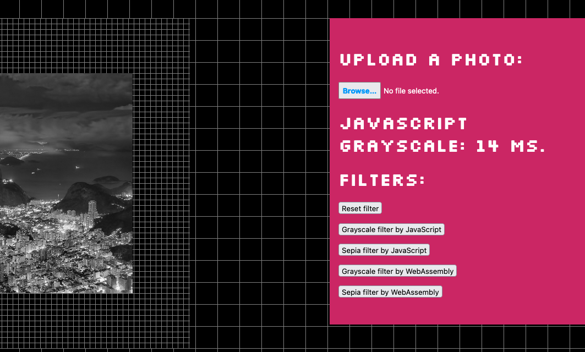
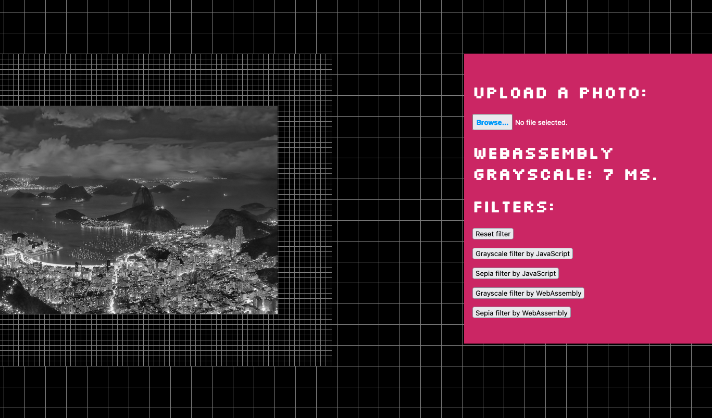

# wasm-image-editor

Image Editor powered by WebAssembly and Rust.

| JavaScript | WebAssembly |
| --- | --- |
|  |  |

## Try it

[Try it: https://raphamorim.io/wasm-image-editor](https://raphamorim.io/wasm-image-editor)

| Filter | WASM (best) | WASM (average) | JavaScript (best) |JavaScript (average) |
| --- | --- | --- | --- | --- |
| [Grayscale](#grayscale) | ~7ms | ~10ms | ~10ms | ~14ms |
| Sepia | WIP | WIP | WIP | WIP |

## Grayscale

Rust:

```rust
let pixels = unsafe { from_raw_parts_mut(data as *mut u8, len) };
let mut i = 0;
loop {
    if i >= len - 1 {
        break;
    }

    // The Weighted Method:
    // Grayscale = 0.299R + 0.587G + 0.114B
    // let grayscale = ((pixels[i] as f32 * 0.3) + (pixels[i+1] as f32 * 0.59) + (pixels[i+2] as f32 * 0.11)) as u8;

    // Average Method:
    // Grayscale = (R + G + B ) / 3
    // Theoretically, the formula is 100% correct.
    // But when writing code, you may encounter uint8 overflow error
    // The sum of R, G, and B is greater than 255.
    // To avoid the exception, R, G, and B should be calculated, respectively.
    // Grayscale = R / 3 + G / 3 + B / 3
    let grayscale = (pixels[i] / 3) + (pixels[i + 1] / 3) + (pixels[i + 2] / 3);
    pixels[i] = grayscale;
    pixels[i + 1] = grayscale;
    pixels[i + 2] = grayscale;
    i += 4;
}
```

Javascript

```javascript
const imageData = context.getImageData(0, 0, canvas.width, canvas.height);
const pixels  = imageData.data;
for (var i = 0, n = pixels.length; i < n; i += 4) {
    const grayscale = pixels[i] * .3 + pixels[i+1] * .59 + pixels[i+2] * .11;
    pixels[i] = grayscale;
    pixels[i+1] = grayscale;
    pixels[i+2] = grayscale;
}
```
