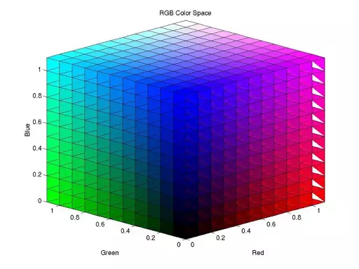

# image-wasm

An image processing library written entirely in WebAssembly and Rust (i.e. zero external or native dependencies).

#### Try it

[https://raphamorim.io/image-wasm](https://raphamorim.io/image-wasm)

#### Benchmark

| Feature | image-wasm (best) | image-wasm (average) | JavaScript (best) |JavaScript (average) |
| --- | --- | --- | --- | --- |
| [Crop](#crop) | ~0ms | ~0ms | ~0ms | ~0ms |
| [Resize](#resize) | ~0ms | ~0ms | ~0ms | ~0ms |
| [Mirror](#mirror) | ~0ms | ~0ms | ~0ms | ~0ms |
| [Grayscale Filter](#grayscale) | ~7ms | ~10ms | ~10ms | ~14ms |
| [Sepia Filter](#sepia) | ~0ms | ~0ms | ~0ms | ~0ms |

Filter suggestion? Open an issue :)

## Summary

- [Tools](#tools)
    - [Crop](#crop)
    - [Resize](#resize)
    - [Mirror](#mirror)
- [Filters](#filters)
    - [Grayscale](#grayscale)
    - [Sepia](#sepia)

## Demo

| JavaScript | WebAssembly (`image-wasm`) |
| --- | --- |
|  |  |

## Installing and using `image-wasm`

Install via yarn or npm:

```sh
yarn add image-wasm
```

## Usage

```javascript
import grayscale from 'image-wasm/grayscale';

const buttonGrayscaleJs = document.querySelector("#grayscale");

// First option is get the base64 of the image:
buttonGrayscale.addEventListener('click', (event) => {
  const image = document.getElementById("image");
  const base64 = grayscale(image, 'Base64');
  image.src = base64;
});
```

You also can get the `Uint8ClampedArray` or `ImageData`:

```javascript
buttonGrayscale.addEventListener('click', (event) => {
  const image = document.getElementById("image");
  const clampedArray = grayscale(image, 'Uint8ClampedArray');
  console.log(clampedArray); // Uint8ClampedArray [...]
  
  const imageData = grayscale(image, 'ImageData');
  console.log(clampedArray); // ImageData ...
});
```

Also to receive image buffer to process it:

```js
import grayscale from 'image-wasm/grayscale';

const image = document.getElementById("image");
const canvas = document.createElement('canvas');
const context = canvas.getContext('2d');
canvas.width = image.naturalWidth || image.width;
canvas.height = image.naturalHeight || image.height;
context.drawImage(image, 0, 0);
const imageData = context.getImageData(0, 0, canvas.width, canvas.height);

const buffer = imageData.data.buffer;
const u8Array = new Uint8Array(buffer);

console.log(grayscale(u8Array, 'Uint8ClampedArray')); // Uint8ClampedArray
```

# Filters



## Grayscale

#### The Weighted Method:

```
Grayscale = 0.299R + 0.587G + 0.114B
```

Example (rust with casting between f32 and u8):

```rust
let grayscale = ((pixels[i] as f32 * 0.3) + (pixels[i+1] as f32 * 0.59) + (pixels[i+2] as f32 * 0.11)) as u8;
```

#### Average Method:

```
Grayscale = (R + G + B ) / 3
```

Theoretically, the formula is 100% correct. But when writing code, you may encounter uint8 overflow error. The sum of R, G, and B is greater than 255. To avoid the exception, R, G, and B should be calculated, respectively.


```
Grayscale = R / 3 + G / 3 + B / 3
```

#### Rust:

```rust
let pixels = unsafe { from_raw_parts_mut(data as *mut u8, len) };
let mut i = 0;
loop {
    if i >= len - 1 {
        break;
    }

    let grayscale = (pixels[i] / 3) + (pixels[i + 1] / 3) + (pixels[i + 2] / 3);
    pixels[i] = grayscale;
    pixels[i + 1] = grayscale;
    pixels[i + 2] = grayscale;
    i += 4;
}
```

#### Javascript:

```javascript
const imageData = context.getImageData(0, 0, canvas.width, canvas.height);
const pixels  = imageData.data;
for (var i = 0, n = pixels.length; i < n; i += 4) {
    const grayscale = pixels[i] * .3 + pixels[i+1] * .59 + pixels[i+2] * .11;
    pixels[i] = grayscale;
    pixels[i+1] = grayscale;
    pixels[i+2] = grayscale;
}
```
